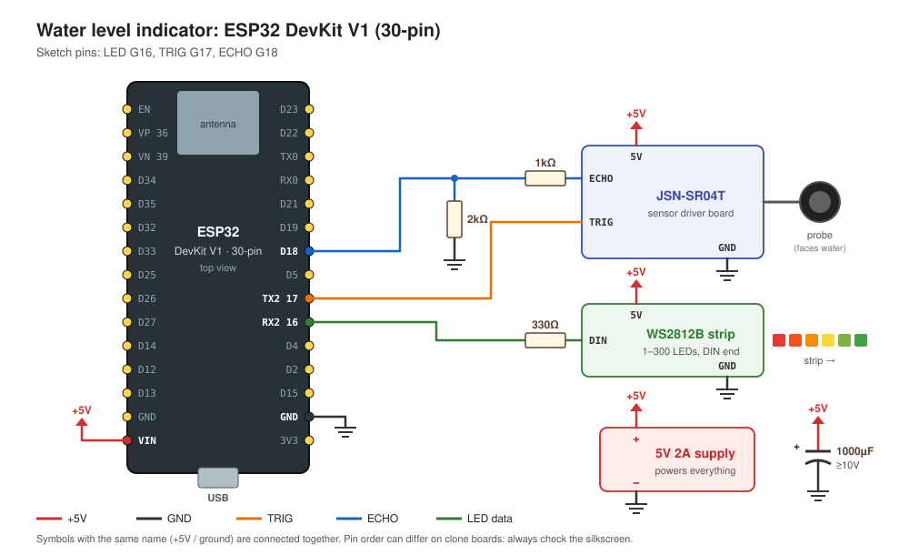
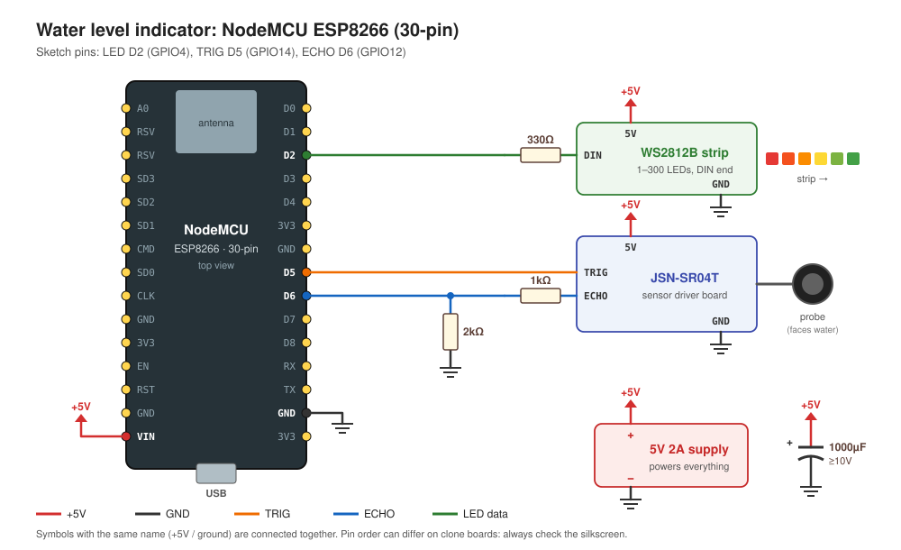
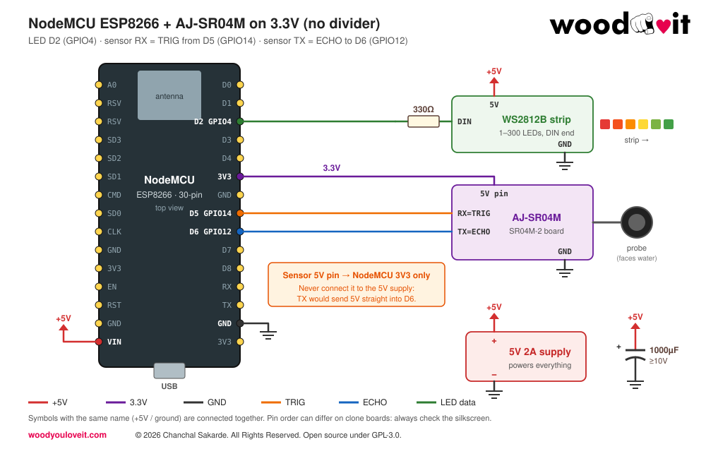
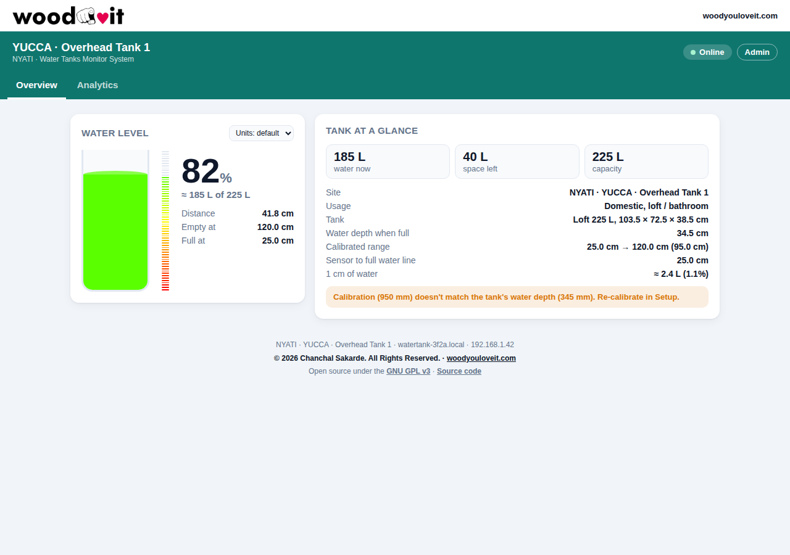
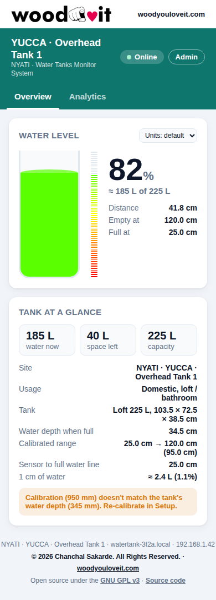
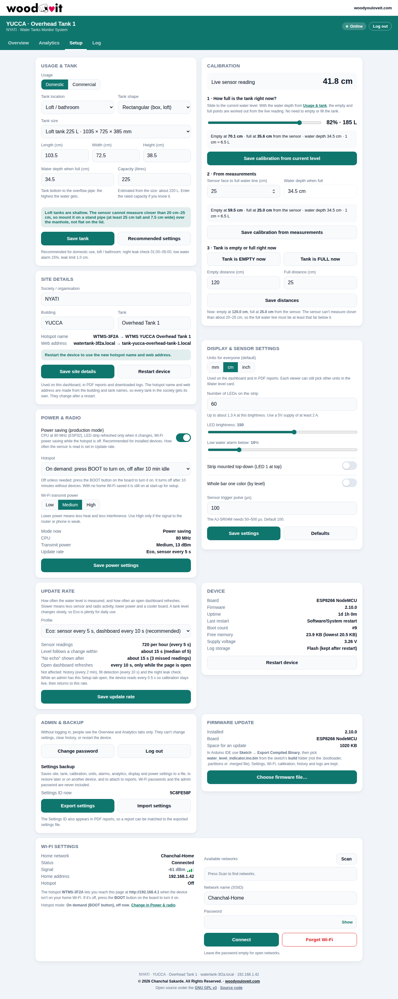
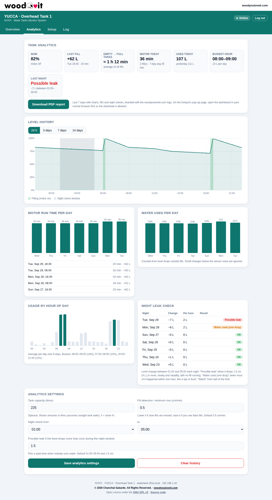
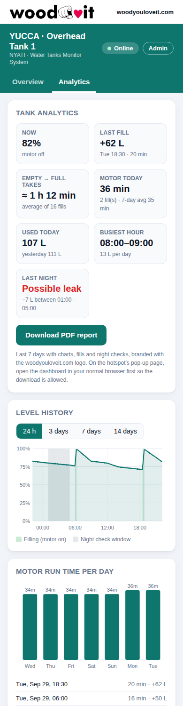

<p align="center">
  <a href="https://woodyouloveit.com"></a>
</p>

# Water Tanks Monitor System

**by [woodyouloveit.com](https://woodyouloveit.com)** · © 2026 Chanchal Sakarde. All Rights Reserved. · Open source under [GPL-3.0](LICENSE)

A tank water level indicator using a waterproof ultrasonic sensor, a WS2812B LED strip (1–300 LEDs) and a built-in web dashboard.
The strip fills from the bottom as the water rises: **red at the bottom, fading through yellow to green at the top**.

One sketch runs on both **ESP32 DevKit V1 (30-pin)** and **NodeMCU ESP8266 (30-pin)**. The board is detected automatically from the Arduino IDE board selection.

## Features

- **Web dashboard** for desktop and mobile browsers: live level, calibration, display settings, Wi-Fi settings
- **Usage & tank setup**: Domestic or Commercial, tank location (overhead, loft/bathroom, underground sump), shape and size, with loft tank presets and recommended settings for each
- **Calibration without emptying the tank**: slide to how full the tank is now, or enter measurements. The water depth does the rest.
- **Power saving for production** (default): CPU 80 MHz, fewer sensor reads, LED updates only on change, Wi-Fi power saving, adjustable transmit power, and an on-demand hotspot using the BOOT button
- **Site details**: name each device by society or organisation, building and tank. The names appear on the dashboard, PDF reports and logs, and give every tank its own hotspot name and web address.
- **Wi-Fi setup hotspot** ("WTMS-XXXX", or "WTMS <building> <tank>" once named): connect and the dashboard opens automatically (captive portal)
- **Wi-Fi settings in the dashboard**: scan, connect, forget. The hotspot comes back by itself if home Wi-Fi is unreachable.
- **One-tap calibration** from the dashboard ("Tank is EMPTY now" / "Tank is FULL now") or by typing distances
- **Admin and viewer access**: anyone on the network sees Overview and Analytics; changing settings, logs, clearing history and restarting need the admin password
- **Units**: mm, cm or inches for every measurement (device default, and each viewer can pick their own)
- **Firmware update over Wi-Fi (OTA)** from the dashboard, with board and version checks
- **Update rate profiles**: Eco (default: sensor every 5 s), Balanced, Responsive or Custom
- **Settings backup**: export and import all settings as a file, with a Settings ID printed in reports
- **PDF report** of the analytics, branded with the woodyouloveit.com logo and website ([sample](docs/sample_report.pdf))
- **Tank analytics**: level history, motor run time (fill detection), time to fill, water used per day and by hour, night leak check
- **Connectivity log** saved in flash: restarts and their cause, Wi-Fi and hotspot events, sensor faults, health checks
- Settings saved in flash, kept after restarts and power cuts
- LEDs keep showing the level while the setup hotspot is open
- Works on ESP32 and ESP8266 without code changes
- Red → yellow → green gradient bar, with the top LED partially dimmed for smooth movement
- Median filter (7 samples) plus smoothing to ignore ripples and stray echoes
- Low-water alarm: the bottom 3 LEDs blink red below 10%
- Sensor fault indication: the bottom LED blinks blue. A failed reading never shows a false "full" tank.
- Optional mode where the whole bar changes color with the level
- Serial output of distance and level for calibration

## Hardware

| Qty | Part | Notes |
|---|---|---|
| 1 | ESP32 DevKit V1 (30-pin) **or** NodeMCU ESP8266 (30-pin) | |
| 1 | JSN-SR04T or AJ-SR04M waterproof ultrasonic sensor | Driver board + probe |
| 1 | WS2812B LED strip, 30 or 60 LEDs (1–300 supported) | 5V version. Set the count in the dashboard. |
| 1 | 5V power supply: 2A for 30 LEDs, 3A for 60 LEDs | Powers the board, strip and sensor. The dashboard shows the estimate for your setup. |
| 1 | 330Ω resistor | In series with the LED data line |
| 1 | 1kΩ resistor | Echo voltage divider |
| 1 | 2kΩ resistor | Echo voltage divider |
| 1 | 1000µF capacitor, 10V or higher | Across the strip's 5V and GND |
| 2 | 15-pin female headers | Makes the board removable |
| 3 | Screw terminals (4-pin, 3-pin, 2-pin) | Sensor, LED strip, power |
| 1 | Perfboard, about 7×9 cm | |

## Wiring

### Pin summary

| Connection | ESP32 DevKit | NodeMCU ESP8266 | Notes |
|---|---|---|---|
| LED strip DIN | G16 | D2 (GPIO4) | Through the 330Ω resistor |
| Sensor TRIG (AJ-SR04M RX) | D15 | D5 (GPIO14) | Direct |
| Sensor ECHO (AJ-SR04M TX) | D2 | D6 (GPIO12) | ESP32: direct, sensor on 3V3. ESP8266: 1k/2k divider, or direct with the sensor on 3V3 |
| Sensor power | 3V3 | VIN or 3V3 | ESP32: 3V3 only, see below |
| +5V | VIN | VIN | From the 5V supply |
| GND | GND | GND | All grounds connected together |

### ESP32 DevKit V1 (30-pin)

On the ESP32 the sensor uses four neighbouring pins, **3V3 · GND · D15 · D2**, so one 4-pin connector or a short row of jumper wires does the job:

| ESP32 pin | AJ-SR04M pin |
|---|---|
| 3V3 | 5V (runs fine on 3.3V) |
| GND | GND |
| D15 | RX (TRIG) |
| D2 | TX (ECHO) |



> **Keep D15 = TRIG and D2 = ECHO, and power the sensor from 3V3.** D15 and D2 are boot "strapping" pins that the ESP32 reads at start-up.
> D2 must be LOW while uploading over USB. The sensor's echo output rests LOW, so uploads work. The sensor's RX input could hold D2 HIGH, so swapping the two wires can make uploads fail.
> With the sensor on 3V3, the echo is 3.3V and needs no divider. Powering the sensor from 5V would put 5V into D2.
> If your board has a blue LED on D2, it will flicker with each measurement. That's normal.
> If an upload ever fails with "wrong boot mode", unplug the sensor connector, upload, and plug it back in.

### NodeMCU ESP8266 (30-pin)



### NodeMCU ESP8266 with AJ-SR04M on 3.3V (no divider)

The AJ-SR04M is rated for 3.0–5.5V. Powered from the NodeMCU's 3V3 pin, its echo output is 3.3V, so it can connect directly to D6 with no resistors. On this board, **RX = TRIG** and **TX = ECHO**. Range may be shorter than at 5V, so test at your tank's full depth.



> **Warning:** In this setup the sensor's 5V pin must go to **3V3 only**. Connecting it to the 5V supply would put 5V straight into D6.

### Why the extra parts

- **1k/2k divider on ECHO:** The sensor's echo output is 5V, but both boards are 3.3V chips. The divider brings the signal down to about 3.3V.
- **330Ω on DIN:** Reduces ringing on the data line and protects the first LED. Place it close to the strip.
- **1000µF capacitor:** Absorbs the current surge when the strip switches on. Mind the polarity: the striped side goes to GND.
- **External 5V supply:** Each LED can draw up to 60mA at full white, so 60 LEDs can need over 3A. The level display uses less (red/green only), and the dashboard shows an estimate for your LED count and brightness. Don't power the strip from the board's USB port.

> **ESP8266 note:** Avoid D3, D4 and D8 for external wiring. The board reads them at boot, and anything connected there can stop it from starting.

## Software setup

1. Install the [Arduino IDE](https://www.arduino.cc/en/software).
2. Add the board package for your board:
   - **ESP32:** In Boards Manager, install "esp32" by Espressif.
   - **ESP8266:** In Preferences → Additional Boards Manager URLs, add
     `http://arduino.esp8266.com/stable/package_esp8266com_index.json`,
     then install "esp8266" from Boards Manager.
3. Install **Adafruit NeoPixel** from Library Manager. Wi-Fi, web server, DNS and mDNS come with the board package.
   The WiFiManager library used by 2.0.0 is no longer needed.
4. Open `water_level_indicator/water_level_indicator.ino`. The dashboard page (`dashboard_html.h`) opens as a second tab.
5. Select the board in **Tools → Board**:
   - ESP32: **ESP32 Dev Module**
   - ESP8266: **NodeMCU 1.0 (ESP-12E Module)**, with **Flash Size: 4MB (FS:2MB OTA:~1019KB)** so the log can be saved in flash
6. Check the **Tools** settings below, upload, then open Serial Monitor at **115200 baud**. The first line shows the firmware version and board.

**Tools settings (ESP32 Dev Module)**

| Setting | Use | Why |
|---|---|---|
| Erase All Flash Before Sketch Upload | **Disabled** | Enabled wipes Wi-Fi, site details, tank setup, calibration, history and logs on every upload |
| Partition Scheme | Default 4MB with spiffs (1.2MB APP / 1.5MB SPIFFS) | The log and history are stored in the "spiffs" area (used by LittleFS) |
| CPU Frequency | 240MHz or 80MHz | Either is fine. In power saving mode the firmware switches to 80 MHz itself. |
| Core Debug Level | None | Keeps the Serial Monitor readable |
| Upload Speed | 921600 | Lower it to 115200 if uploads fail |

**Tools settings (NodeMCU 1.0)**: Flash Size **4MB (FS:2MB OTA:~1019KB)**, Erase Flash **Only Sketch**.

After the very first upload, or after an upload with erase enabled, the flash storage is blank. The firmware formats it by itself and logs
"Flash storage was blank and has been formatted", and the boot counter starts at #1. That's normal.
Settings then need to be entered once in the dashboard.

## First-time Wi-Fi setup

1. Power the device. With no home Wi-Fi saved, it opens the hotspot **WTMS-XXXX** (XXXX is unique to each board) and the top LED blinks blue.
2. Connect your phone or laptop to that hotspot. The dashboard opens automatically.
   If it doesn't, open a browser and go to `http://192.168.4.1`.
3. In **Wi-Fi settings**, press **Scan**, pick your network, enter the password and press **Connect**.
4. The dashboard shows the new address (`http://watertank-xxxx.local` or the IP). The hotspot turns off 30 seconds later.
5. In **Site details**, enter the society or organisation, building and tank names, save, and restart the device (see below).
   Switch your phone or PC back to your home Wi-Fi and open that address.

If the device can't reach your home Wi-Fi (router off, wrong password, moved too far), the hotspot turns back on automatically.
The device retries your home network every minute while nobody is connected to the hotspot.

No home Wi-Fi at the tank? Just leave it on the hotspot and use `http://192.168.4.1`.

## Site details (society, building, tank)

Every device is named in the **Site details** card on the Overview tab:

| Field | Example | Max length |
|---|---|---|
| Society / organisation | NYATI | 48 |
| Building | YUCCA | 32 |
| Tank | Overhead Tank 1 | 32 |

The names are used:
- **on the dashboard:** header ("YUCCA · Overhead Tank 1", with the society underneath), browser tab title and footer
- **in the PDF report:** site title, a details table, page headers, document properties and the file name, e.g. `wtms-report-yucca-overhead-tank-1-20260930.pdf`
- **in the downloaded connectivity log** header and file name

The **hotspot name** and **web address** are made from the building and tank names, so several tanks in one society don't clash:

| Site details | Hotspot name | Web address |
|---|---|---|
| Not set | `WTMS-3F2A` (from the chip ID) | `http://watertank-3f2a.local` |
| YUCCA / Overhead Tank 1 | `WTMS YUCCA Overhead Tank 1` | `http://tank-yucca-overhead-tank-1.local` |
| Tower A / Tank #2 (Sump) | `WTMS Tower A Tank #2 (Sump)` | `http://tank-tower-a-tank-2-sump.local` |

The card previews both before you save. They take effect after **Restart device**. Hotspot names are cut to 32 characters (a Wi-Fi limit), so keep building and tank names short.
WTMS stands for Water Tanks Monitor System.

## Dashboard

Open the dashboard from any device on the same network:

- `http://<web address>.local`, shown in **Site details** (Windows, macOS, iOS, Linux; some Android phones don't support `.local`)
- or the device's IP address, shown in Serial Monitor and in your router's device list

| Desktop | Mobile |
|---|---|
|  |  |



The dashboard has four tabs: **Overview**, **Analytics**, **Setup** and **Log**.

| Tab · card | What it does |
|---|---|
| Overview · Water level | Live level in % and litres, tank graphic and LED strip preview. Shows sensor fault, low water, filling and leak alerts. |
| Overview · Tank at a glance | Water now, space left, capacity, site, usage, tank size, water depth, calibrated range, litres per cm, and setup warnings |
| Setup · Usage & tank | Domestic / Commercial, location, shape, size (loft presets or custom), water depth, capacity, **Recommended settings** |
| Setup · Calibration | Current-level slider, calibration from measurements, EMPTY / FULL buttons, manual distances |
| Setup · Site details | Society / organisation, building and tank names |
| Setup · Display & sensor | LED brightness, low water alarm, strip direction, color mode, trigger pulse. **Defaults** restores factory settings. |
| Setup · Wi-Fi settings | Saved network, status, signal, home address and hotspot state. **Scan** lists nearby networks, **Connect** joins one (saved only if it works), **Forget Wi-Fi** erases the saved network. |
| Setup · Device | Board, firmware, uptime, cause of the last restart, boot count, free memory, supply voltage (ESP8266), **Restart device**. |
| Log | Every restart, Wi-Fi and hotspot event with time, filters, **Download** and **Clear**. See below. |

## Configuration

All of these settings can be changed from the dashboard and are saved in flash. The table shows the factory defaults.

| Setting | Default | Description |
|---|---|---|
| Number of LEDs | `30` | 1–300. Kept when you press **Defaults**. |
| Empty distance | `120` cm | Distance from the sensor to the water surface when the tank is empty |
| Full distance | `25` cm | Distance when the tank is full. Keep this at 20–25 or more (sensor blind zone). |
| LED brightness | `150` | 5–255 |
| Strip mounted top-down | off | Turn on if LED #1 is at the top of the tank |
| Whole bar one color | off | On: the whole bar is red when low and green when full |
| Low water alarm | `10` % | Level below which the bottom LEDs blink red |
| Trigger pulse | `100` | Trigger pulse length in µs. The AJ-SR04M ignores 10–20µs pulses. |

Fixed in the sketch: `MAX_VALID_CM` (450), readings above it are treated as "no target". The hotspot name (`AP_NAME`) and hostname (`HOSTNAME`) are also defined at the top of the sketch.

The pin numbers for each board are in the `#if defined(ESP32)` / `#elif defined(ESP8266)` block.

### Usage & tank (Setup tab)

| Setting | Options | What it changes |
|---|---|---|
| Usage | Domestic, Commercial | Recommended night leak window and low water alarm; shown in reports |
| Tank location | Overhead (roof), Loft / bathroom, Underground sump, Other | Mounting tips and recommended low water alarm |
| Tank shape | Rectangular (box, loft), Vertical cylinder | Which dimensions are asked and how capacity is estimated |
| Tank size | Loft presets or custom length × width × height / diameter × height (mm) | Tank details in the dashboard and reports |
| Water depth when full | mm, tank bottom to the overflow pipe | Used by the calibration slider and measurement method |
| Capacity | litres | Litres everywhere (level, analytics, reports) |

**Loft tank presets** (rated capacity, outer size in mm):

| Capacity | Length | Width | Height | Water depth preset |
|---|---|---|---|---|
| 150 L | 710 | 710 | 400 | 360 |
| 225 L | 1035 | 725 | 385 | 345 |
| 270 L | 1100 | 735 | 425 | 385 |
| 400 L | 1120 | 875 | 420 | 380 |
| 500 L | 1450 | 915 | 445 | 405 |
| 1000 L | 1650 | 1080 | 685 | 645 |

The preset water depth is the tank height minus 40 mm. Measure your overflow pipe and correct it if needed.
Outer dimensions overstate capacity by 3–26% (walls, ribs, sloped top), so the rated capacity is used for litres, not length × width × height.

**Recommended settings** (button in Usage & tank, applied only when you confirm):

| | Domestic | Commercial |
|---|---|---|
| Night leak check | 01:00–05:00 | 22:00–06:00 (after hours) |
| Low water alarm | 15% (30% for a sump) | 25% (30% for a sump) |
| Leak limit | 2% of the water depth, at least 1 cm | same |

### Calibration (Setup tab)

Pick whichever is easiest. All three give the same result: the sensor distance at **empty** and at **full**.

1. **How full is the tank right now?** Set **Water depth when full** in Usage & tank, then slide to the current level (e.g. 70%) and save.
   The firmware works out: empty = live reading + level × depth, full = empty − depth. No need to empty or fill the tank.
2. **From measurements:** enter the distance from the sensor face to the full (overflow) water line. Empty = that distance + water depth.
3. **Tank is EMPTY / FULL now** buttons, or type both distances.

Each method previews the result and warns if the full water line is inside the sensor's blind zone.

**Sensor blind zone, especially on loft tanks.** The AJ-SR04M / JSN-SR04T can't measure closer than about 20–25 cm.
Loft tanks are only 385–685 mm tall, so a sensor mounted flat on the lid would miss the top half of the tank.
Mount it on a **stand pipe at least 25 cm tall and 75 mm wide** over the manhole, so the full water line is 25 cm or more below the sensor face.
On a shallow tank, 1 cm of water is about 2.5% of the tank (≈ 6 L in a 225 L loft tank). That's the resolution you can expect.

## How it works

```
level = (empty distance - distance) / (empty distance - full distance)    clamped to 0..1
LEDs lit = level × number of LEDs, counting from the bottom of the strip
LED color = its position on the strip: bottom red → middle yellow → top green
```

The sensor is read every 70ms and the median of the last 7 readings is used. The level is then blended with the previous value so the bar moves smoothly. Ten misses in a row show the sensor fault blink.

## Power, heat and production use

The ESP32 runs warm mainly because of the Wi-Fi radio. A hotspot can't use Wi-Fi power saving, and full transmit power is far more than a phone next to the tank needs.
The **Power & radio** card (Setup tab) controls this:

| Setting | Options | Default |
|---|---|---|
| Power saving (production mode) | on / off (performance) | **on** |
| Hotspot | Automatic, On demand (BOOT button), Always on | Automatic |
| Wi-Fi transmit power | Low 8.5 dBm, Medium 13 dBm, High 19.5 dBm | **Medium** |

| | Power saving (default) | Performance |
|---|---|---|
| CPU (ESP32) | 80 MHz | 240 MHz |
| LED strip | refreshed 4 times a second, only when something changed | 10 times a second |
| Wi-Fi | modem sleep while the hotspot is off | always awake |
| Main loop | pauses 5 ms per pass | pauses 1 ms per pass |
| Serial output | log lines only | log lines + live distance every second |
| Dashboard refresh | every 2 s | every second |

**Hotspot modes**
- **Automatic:** on while there's no home Wi-Fi or it can't be reached; off 30 s after home Wi-Fi connects.
- **On demand:** best for installed devices. The hotspot stays off until someone presses the **BOOT** button on the ESP32 (the **FLASH** button on a NodeMCU). It turns off after 10 minutes without devices connected. With no home Wi-Fi saved it still starts for setup, and with no home Wi-Fi and no hotspot the radio is switched off completely.
- **Always on:** only if you really need it. It uses the most power and runs warmest.

The top LED blinks blue whenever the hotspot is on. Every change is recorded in the connectivity log.

**Recommended production setup:** power saving on, hotspot on demand, transmit power Low or Medium (Medium if the router is in another room).

**Other heat sources**
- **The 3.3V regulator** next to the USB socket turns 5V into 3.3V for the ESP32 and the sensor. It gets warm, and that's normal. If it's too hot to touch, check for a short on 3V3 and make sure the LED strip is powered from the 5V supply, not through the board.
- **The enclosure:** leave a few ventilation holes, and don't mount the board against the LED strip or in direct sun.

## Admin and viewer access

| | Viewer (no login) | Admin |
|---|---|---|
| Overview tab (level, litres, tank at a glance) | ✓ | ✓ |
| Analytics tab (charts, fills, night check, PDF report) | ✓ | ✓ |
| Analytics settings: save, clear history | view only | ✓ |
| Setup tab (tank, calibration, site, display, power, Wi-Fi, device, backup) | hidden | ✓ |
| Log tab | hidden | ✓ |
| Restart the device, reset to defaults | ✗ | ✓ |

- Press **Admin** in the header to log in. The **default password is `admin`**, and it must be changed at the first login (at least 6 characters).
- **Forgot the password?** Hold the **BOOT** button (ESP32) or **FLASH** button (NodeMCU) for **10 seconds** until the strip flashes red. The password goes back to `admin`.
- An admin session ends after 12 hours without activity, or when the device restarts. Up to 3 admin sessions can be open at once.
- After 5 wrong passwords, login is blocked for a minute. Logins, failed logins and password changes are recorded in the log.
- **Security note:** the password itself never crosses the network. The browser answers a one-time challenge with a SHA-256 proof, and only a salted hash is stored on the device. The dashboard uses plain HTTP, though, so on an untrusted network the session token could be observed. Keep the device on your own Wi-Fi.

## Units

All measurements can be shown in **mm**, **cm** or **inches**: distances, tank dimensions, water depth, calibration, leak limit, fill speed, the "1 unit of water = X L" resolution, and the PDF report.

- **Admin default for everyone:** Setup → Display & sensor → *Units for everyone*.
- **Per browser:** the *Units* menu in the Water level card overrides the default on that phone or PC only.

The device always stores centimetres and millimetres internally, so switching units never changes the calibration.

## Settings backup and the Settings ID

Setup → **Admin & backup**:
- **Export settings** downloads a JSON file with the site, tank profile, calibration, capacity, alarms, analytics, units, display, sensor and power settings.
- **Import settings** restores such a file, on this device or another one. Wi-Fi is not changed.
- Wi-Fi passwords and the admin password are **never** exported.

The **Settings ID** is an 8-character fingerprint of those settings. It's shown in the Admin card, in the exported file, in the PDF report's details and footer, and in the report's **"Settings used for this report"** page.
Anyone checking a report can confirm which configuration produced its figures by matching the ID with an exported settings file.

## Update rate

How often the sensor is read and how often an **open** dashboard refreshes (Setup → **Update rate**):

| Profile | Sensor reading | Median of | Level follows a change within | "No echo" after | Dashboard refresh |
|---|---|---|---|---|---|
| **Eco** (default) | every 5 s (720/hour) | 5 | ~15 s | ~15 s | every 10 s |
| Balanced | every 2 s | 5 | ~6 s | ~14 s | every 5 s |
| Responsive | every 0.5 s | 7 | ~2 s | ~5 s | every 2 s |
| Custom | 0.2–30 s | 5 or 7 | shown in the card | shown in the card | 2–60 s |

- The dashboard refresh only happens while someone has the page open. With no page open, the device serves nothing.
- History (every 2 min), fill detection (every 10 s) and the night leak check don't depend on the profile.
- **Live mode for calibration:** while an admin has the Setup tab open, the device reads every 0.5 s and the page refreshes every 2 s.
  It returns to the saved profile 20 s after the Setup tab is closed.
- The biggest continuous power user is the Wi-Fi radio, not the sensor. For the coolest, longest-lived setup, combine **Eco** with **Power saving**, the **On demand** hotspot and **Low/Medium** transmit power.

## Firmware update over Wi-Fi (OTA)

Setup → **Firmware update** (admin only):

1. In Arduino IDE, with the same board settings as before, choose **Sketch → Export Compiled Binary**.
2. In the sketch folder, open `build/<board>/` and take **`water_level_indicator.ino.bin`**, not the `.bootloader`, `.partitions` or `.merged` files.
3. In the dashboard, press **Choose firmware file…**. Before uploading, the dashboard checks that:
   - it's an ESP firmware file
   - it's Water Tanks Monitor System firmware for **this** board (ESP32 or ESP8266)
   - it fits in the free space

   It also shows the version and warns about downgrades.
4. Confirm. A progress bar shows the upload. The device verifies the image, restarts, and the page reports the new version.

**Kept:** settings, Wi-Fi, admin password, calibration, history and logs.
**Safety:** the new firmware goes into the spare program slot. If the upload is interrupted or the image fails verification, the current firmware keeps running.

**Size limits:**
- **ESP32** (Partition Scheme "Default 4MB with spiffs"): two 1.2 MB program slots. Anything that fits by USB fits OTA.
- **ESP8266 NodeMCU:** the new program is written next to the running one inside a ~1 MB area, so OTA works only while the program is under about **500 KB**. The card shows the space available. If a build is too big, update once by USB.

Every update and failure is recorded in the connectivity log.

## Tank analytics

The **Analytics** tab turns the level history into answers about your tank. The device records the level every 2 minutes in flash (14 days)
and detects fills itself from 10-second samples. The charts are calculated in your browser, in your local time.

| Section | What it shows |
|---|---|
| Summary tiles | Level now (or **Filling** with rise speed and time until full), last fill, how long empty → full takes, motor time today, water used today, busiest hour, last night's leak check |
| Level history | 24 h / 3 / 7 / 14 days, with fills (motor on) and the night check window shaded. Hover or tap for exact values. |
| Motor run time per day | Total filling time for the last 7 days, and the 5 most recent fills with duration and amount |
| Water used per day | Level drops outside fills, for the last 7 days |
| Usage by hour of day | Average use for each hour, busiest 3 hours highlighted |
| Night leak check | Level change in a quiet window (default 01:00–05:00) for the last 7 nights |

**How it decides**
- **Filling / motor on:** the level rises faster than the fill threshold (default 0.5 cm/min) by at least 1.5 cm. Filling ends when the rise slows down or the tank is full. Fills shorter than 3 minutes or 3 cm are ignored. The device assumes every fill is the motor.
- **Water used:** every drop in level outside a fill, with a small dead band so sensor noise isn't counted as use.
- **Night leak check:**
  - **Possible leak:** the level drops by more than the limit (default 1.5 cm) slowly and steadily, with no fill running.
  - **Water used (one drop):** most of the drop happened within one hour, like a tap or a flush.
  - **Watch:** the drop is between half the limit and the limit.
  - A leak warning for last night also shows on the Overview tab.

**Analytics settings** (bottom of the Analytics tab)
- **Tank capacity (litres):** optional. With it, amounts show in litres; without it, in %. This assumes straight tank walls, so the litres are approximate for tapered tanks.
- **Fill detection threshold:** lower it if slow fills are missed, raise it if you see false fills.
- **Night check window and leak limit:** pick hours when nobody normally uses water.
- **Clear history** erases the recorded levels and fills.

History needs the real time. That comes from the internet on home Wi-Fi, or from your browser when you open the dashboard on the hotspot.
Distances are stored rather than %, so re-calibrating later also corrects old history.

| Desktop | Mobile |
|---|---|
|  |  |

### PDF report

In the **Analytics** tab, press **Download PDF report**. The report is created in your browser (it works offline on the hotspot too) and covers the last 7 days:

- **Page 1:** woodyouloveit.com logo and website, report date and period, device and tank details, summary tiles, 7-day level history chart, motor run time and water used per day
- **Page 2:** usage by hour of day, night leak check table, recent fills, how the numbers are calculated
- **Page 3:** "Settings used for this report": calibration, capacity, resolution, units, alarm limits, night window, leak and fill thresholds, recording intervals, power mode, firmware and the Settings ID
- **Every page:** © 2026 Chanchal Sakarde. All Rights Reserved., woodyouloveit.com, page number, firmware and Settings ID

See the [sample report](docs/sample_report.pdf) (made from simulated data).
If you opened the dashboard from the hotspot's pop-up window, open `http://192.168.4.1` in your normal browser first. Some pop-up windows don't allow downloads.

## Connectivity log

The device records events in flash, so they survive restarts and power cuts (about 300–400 events, oldest dropped first).
Open the **Connectivity log** card in the dashboard, or download it as a text file to share.

| Event | What it tells you |
|---|---|
| `Boot #N ... restart cause: ...` | Every start. **Power on** means power was cut or dipped; **Watchdog**, **Exception**, **Crash** or **Brownout** mean a problem (shown in red). |
| `Supply voltage` (ESP8266) | The board's 3.3V rail at boot and every 5 minutes. Below 3.0V means the supply is struggling. |
| `Hotspot on / off (reason)` | When and why the hotspot changed. "connected to home Wi-Fi" is normal. |
| `Device joined / left hotspot` | Phones and PCs connecting to the hotspot, by MAC address. |
| `Hotspot channel changed` | The ESP8266 hotspot must use the same channel as the home Wi-Fi. When it changes, devices on the hotspot are disconnected briefly. |
| `Home Wi-Fi lost / disconnect event` | With the reason, e.g. "signal lost (beacon timeout)" or "wrong password?". |
| `Health` (every 5 min) | Free memory, supply voltage, slowest main loop, hotspot clients, Wi-Fi signal and channel. |
| `Main loop was blocked` | Something stalled the firmware for more than 2 s. |
| `Sensor fault / Sensor OK` | Ultrasonic sensor stopped or started answering (at most once per 30 s). |

Times come from the internet when on home Wi-Fi, or from your browser when you open the dashboard on the hotspot.
Before that, events show as `Boot #N +h:mm:ss` (time since that start).

**Reading a "hotspot disappears" problem**
- Many `Boot #` lines with **Power on** and a low supply voltage: the board is resetting from power dips. Use a 5V supply that can handle the LED strip, not USB.
- `Hotspot off (connected to home Wi-Fi)`: expected. Turn on **Keep hotspot always on** in Wi-Fi settings if you want it to stay.
- `Hotspot channel changed`: the device is joining or retrying your home Wi-Fi on another channel.
- `Home Wi-Fi lost: signal lost`: weak signal at the tank. The device switches to the hotspot until the home Wi-Fi is back.

## LED indications

| Display | Meaning |
|---|---|
| Red → green sweep at power-up | Startup test |
| Top LED blinking blue | The device's hotspot is on |
| Bar from the bottom | Current water level |
| Bottom 3 LEDs blinking red | Water below 10% |
| Bottom LED blinking blue | No echo from the sensor. Check the wiring, the divider and the probe position. |

## Troubleshooting

| Problem | Things to check |
|---|---|
| LEDs flicker or show random colors | Common ground between the supply, board and strip; the 330Ω resistor; the capacitor. A 74AHCT125 level shifter on DIN helps with long wires. |
| Blue blink (no echo) | ECHO divider wiring; sensor powered from 5V; probe too close to the water (inside the 25cm blind zone) |
| Level jumps around | Probe not vertical, or the beam hits the tank wall or pipes |
| Only part of the strip lights up at full level | Set **Number of LEDs on the strip** in Display & sensor settings to match your strip. |
| Bar fills from the wrong end | Turn on **Strip mounted top-down** in the dashboard |
| Blue blink with an AJ-SR04M | Run `tools/sensor_diagnostic` to check the wiring and find a working trigger width |
| Dashboard doesn't open by itself on the hotspot | Open a browser and go to `http://192.168.4.1`. On Android, tap the "Sign in to network" notification. |
| Hotspot connects but the page never loads | Type `http://192.168.4.1` exactly (with `http://`). Other sites and `https://` addresses can't be redirected. On a phone, turn off mobile data while setting up. Check Serial Monitor: repeating `Boot #` lines mean the board keeps restarting. |
| Hotspot disappears | Open the **Connectivity log**. See "Reading a hotspot disappears problem" above. |
| Device card says "Log storage: Memory only" | On ESP8266, select **Tools → Flash Size → 4MB (FS:2MB OTA:~1019KB)** and upload again. |
| The `.local` address doesn't open | Use the IP address instead. Some Android phones don't support `.local` names. |
| Serial shows `esp_littlefs ... Corrupted dir pair` or `mount failed (-84)` (firmware 2.8.0 and older) | The flash storage was blank, usually because **Erase All Flash Before Sketch Upload** is Enabled. The firmware formats it automatically. Set that option to Disabled so settings survive uploads. |
| Settings, Wi-Fi or calibration lost after an upload | **Tools → Erase All Flash Before Sketch Upload** must be **Disabled** (ESP32), or **Erase Flash: Only Sketch** (NodeMCU). |
| Hotspot doesn't appear | In on-demand mode it's off until you press **BOOT** (ESP32) or **FLASH** (NodeMCU). The top LED blinks blue when it's on. |
| Board gets hot | Turn on **Power saving**, set the hotspot to **On demand**, and lower the transmit power. See "Power, heat and production use". |
| Dashboard unreachable after changing the router | Wait about 20 seconds: the hotspot turns on by itself. Connect to it and choose the new network in Wi-Fi settings. |
| ESP8266 won't boot with the circuit connected | Make sure nothing is connected to D3, D4 or D8 |

## Branding

The woodyouloveit.com brand appears on:

- the dashboard (logo bar, page title, footer with copyright and website, heart icon in the browser tab)
- the PDF report (logo, website and copyright on every page, and in the document properties)
- the downloaded connectivity log, the Serial Monitor start-up message, and the wiring diagrams
- the header of every source file

The logo is built into the firmware (`dashboard_html.h`), so it shows even without internet. The original is in `docs/logo.png`.

## License

Copyright (C) 2026 Chanchal Sakarde, [woodyouloveit.com](https://woodyouloveit.com). All Rights Reserved, except as granted by the license below.

This project is free software: you can redistribute it and/or modify it under the terms of the
**GNU General Public License** as published by the Free Software Foundation, either version 3 of the License,
or (at your option) any later version. It is distributed in the hope that it will be useful, but **without any warranty**.
See [LICENSE](LICENSE) for the full text.

Every source file carries this notice and `SPDX-License-Identifier: GPL-3.0-or-later`.
If you share a modified version, keep the copyright notices and publish your source code under the same license.

## Project structure

```
water-level-indicator/
├── water_level_indicator/
│   ├── water_level_indicator.ino   # Sketch for ESP32 and ESP8266
│   ├── dashboard_html.h            # Web dashboard page (HTML/CSS/JS)
│   ├── auth.h                      # Admin login: SHA-256, password, sessions
│   ├── event_log.h                 # Connectivity log stored in flash (LittleFS)
│   └── history.h                   # Level history and fill (motor) detection
├── docs/
│   ├── wiring_esp32.svg            # ESP32 wiring diagram
│   ├── wiring_esp8266.svg          # NodeMCU wiring diagram
│   ├── wiring_esp8266_3v3.svg      # NodeMCU, sensor on 3.3V, no divider
│   ├── wiring_*.png                # PNG versions of the diagrams
│   ├── dashboard_*.png             # Dashboard screenshots
│   ├── setup_desktop.png           # Setup tab screenshot
│   ├── analytics_*.png             # Analytics screenshots
│   ├── logo.png                    # woodyouloveit.com logo
│   ├── sample_report.pdf           # Example PDF report (simulated data)
│   └── gen_diagrams.py             # Regenerates the diagrams
├── tools/
│   └── sensor_diagnostic/          # Sensor wiring and mode test sketch
├── CHANGELOG.md
├── LICENSE                         # GNU General Public License v3
├── README.md
└── .gitignore
```

To regenerate the diagrams after editing `docs/gen_diagrams.py`:

```bash
pip install cairosvg
python docs/gen_diagrams.py
```
